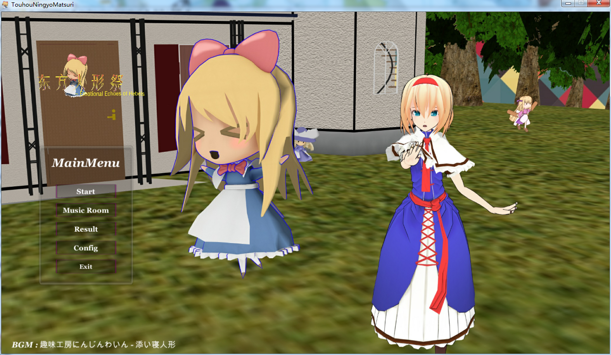
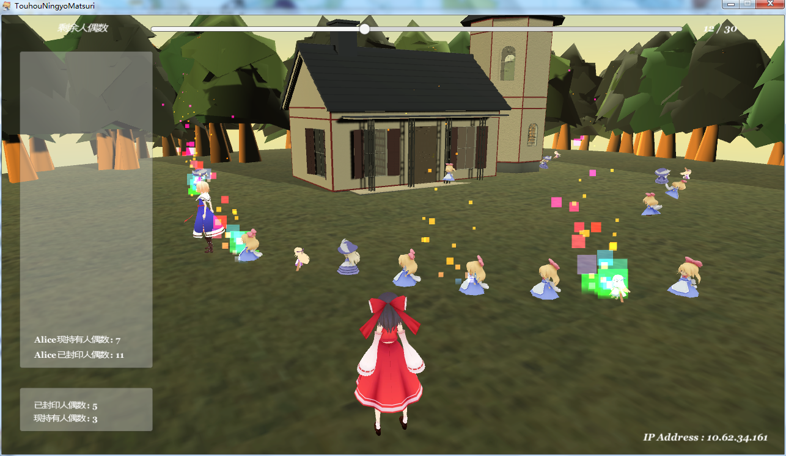
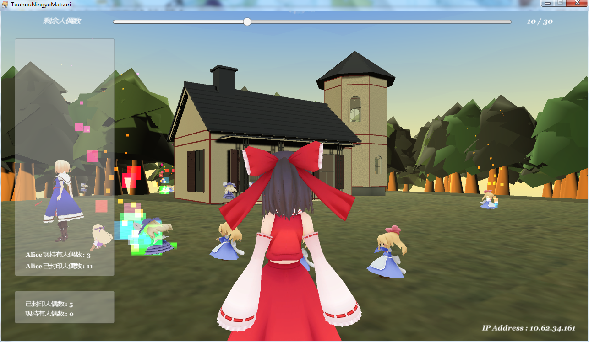
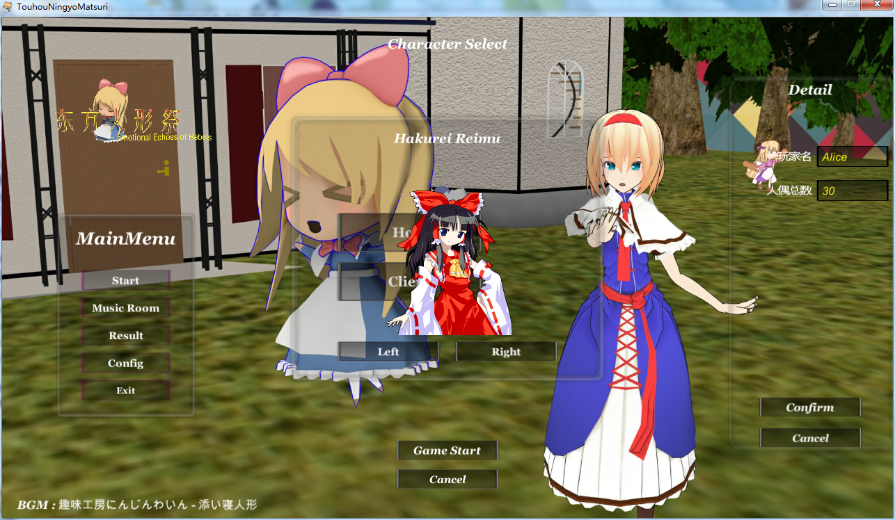
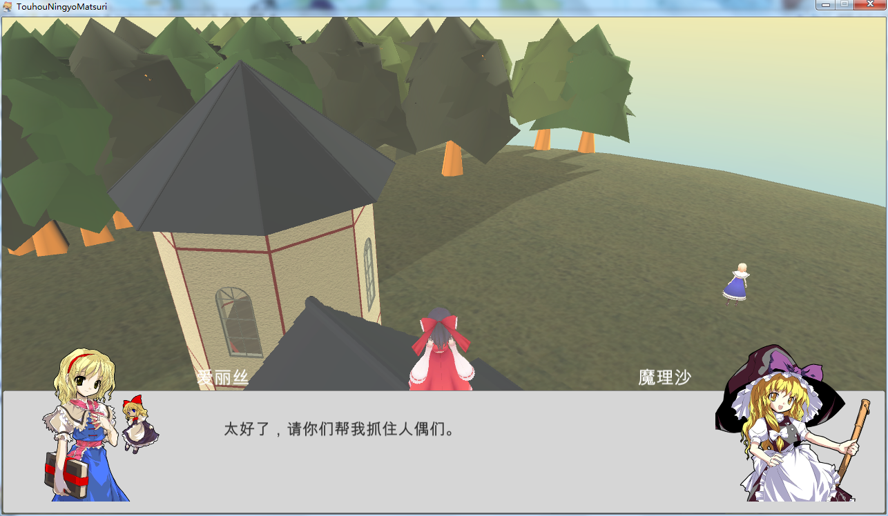
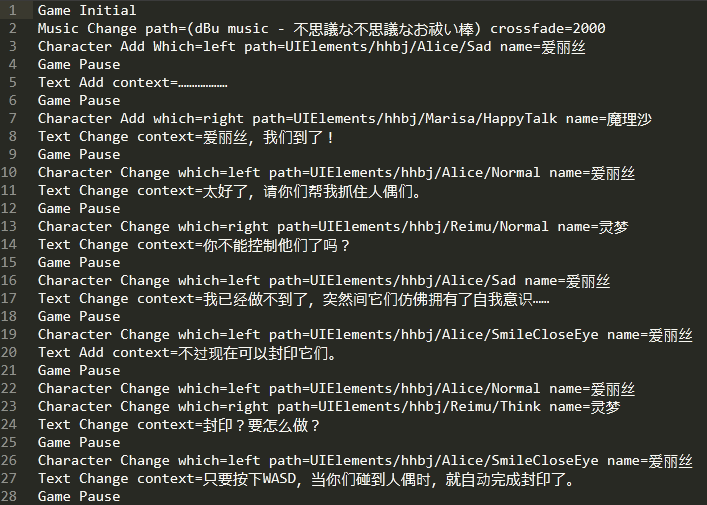

# 东方人形祭

东方的二次创作。作为北理沙包大会的一个小节目。整了一个月。本来是个课程设计，又改了改。美术、剧情、游戏、程序都很贫穷- -。。。本着开源和同人的精神在形式上公开了(自我处刑

## 游戏截图

### 初始界面

### 多人游戏

### 角色选择

### AVG对话

### AVG脚本

## 程序内容

### Unet

采用了Unity的多人游戏API——Unet，全称是Unity Networking。网上的教程比较单一，这个项目用了更多的Unet功能，可以让局域网内的玩家一起游戏。具体的就是实现了将重要数据保存在服务器，防止玩家作弊；可以选择自机，而不是单一玩家预制体；实现了网络位置同步组件，感觉比Unity自带的好用；游戏消息在网络之间的广播等功能。说了这么多，其实也没多少自己写的代码。

### UI框架

实现了UI框架之后，UI的功能扩展、程序编写和一些美术的表现就变得相对容易了。UI框架参考了[这位大神](https://github.com/MrNerverDie/Unity-UI-Framework)的。好用。

### AVG引擎

采用了Interpreter设计模式，实现了自己的脚本语言，进而完成了一个简单的AVG引擎。因为要用类似逆波兰表达式的方法遍历脚本，还要用递归去翻译脚本，所以效率不高。虽然功能比较好扩展，但是要针对每一个函数写一个类，即使引擎的程序架构清晰，但也显得臃肿。至少功能实现了(

## 借物表

### 原作
 
「東方Project」 - 上海アリス幻樂団

### Music

添い寝人形 ----- 趣味工房にんじんわいん

不思議な不思議なお祓い棒 ----- dBu music

今日ぞハレの日、われらが祭り ----- ジャージと愉快な仲間たち

幽境奏楽 ----- グーシャンダグー

童祭　~ Innocent Treasures ----- 市松椿

### Model
にがっぽいしえら式アリス ----- しえら

にがもん式霊夢V01_s05a配布用 ----- にがもん

MarisaV12STI ----- にがもん

仏蘭西人形  ----- nya

sh216 ----- nya

syanhai66 ----- nya

harina_kyoningyo216_v1.0 ----- harina

### Stage

アリス邸 ----- ニコニコ３D鉄道部

### Motion

Unitychan ----- Unity

### Tool

Unity

MMD